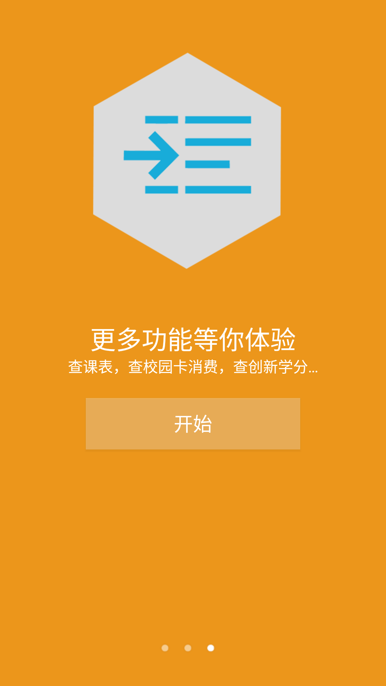

# HelloUSTB
a school app for USTB studentd http://genshen.hol.es/blog/frontend/web/index.php?r=hello

This is a Android based campus assistant application,whitch services to USTB students. 
At present, we provide notice checking,score checking , campus network connecting,curriculum checking and some other functions.

Download address：http://genshen.hol.es/blog/frontend/web/index.php?r=hello
--the old repository has removed
