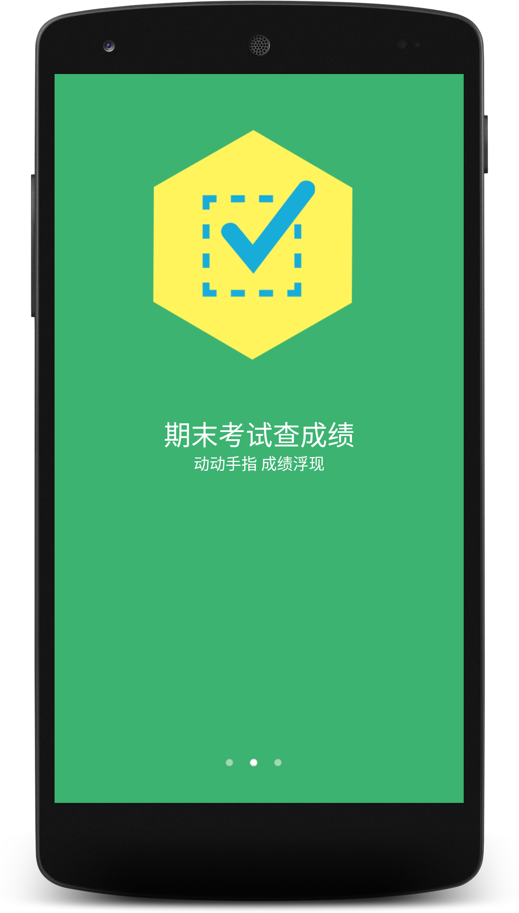
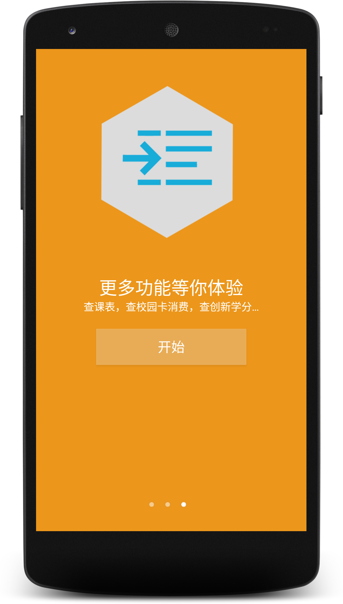
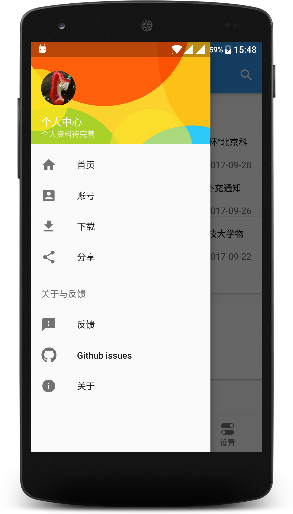
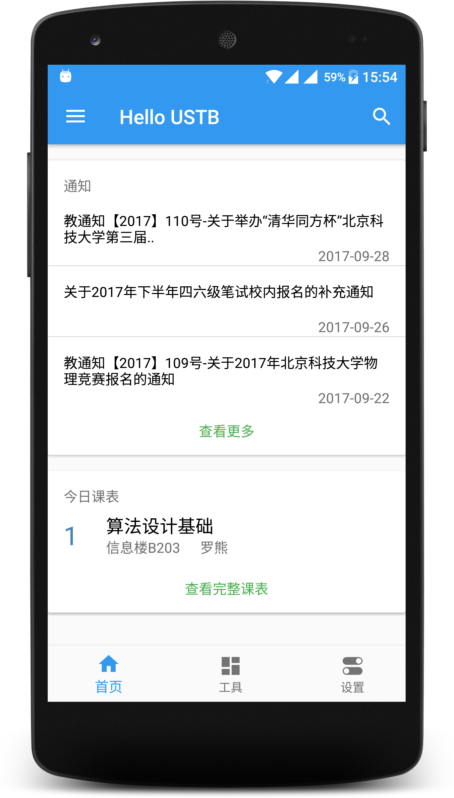
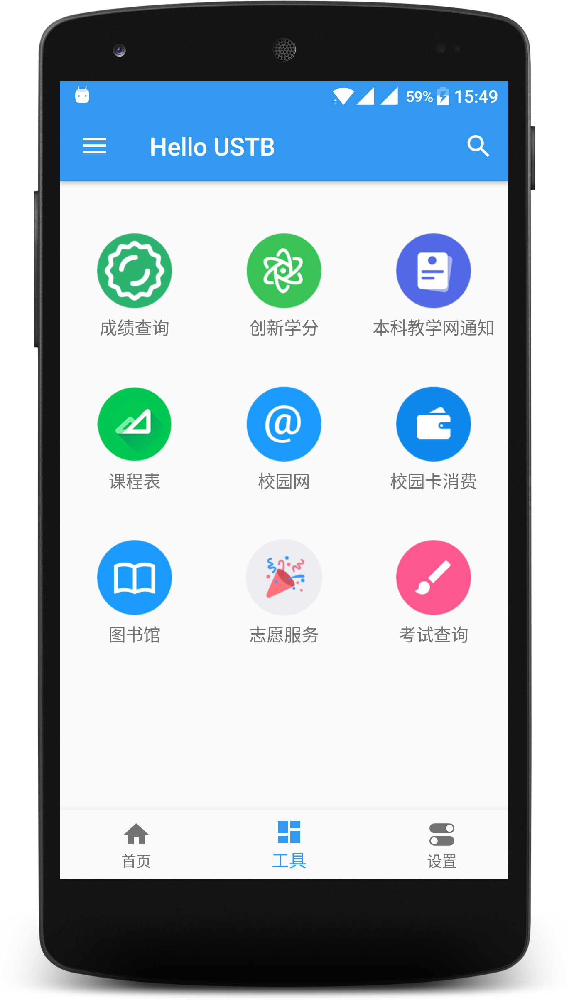

# HelloUSTB
a school app for USTB students https://github.com/genshen/HelloUSTB

This is a Android based campus assistant application,whitch services to USTB students. 
At present, we provide notice obtaining,score inquiry , campus network connecting,curriculum inquiry and some other functions.

Download address：https://github.com/genshen/HelloUSTB/releases
